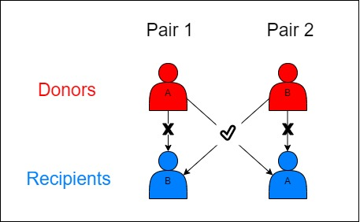

```{r setup, include=FALSE}
knitr::opts_chunk$set(echo = TRUE)
library(tidyverse)
```

Patients are blood type compatible according to the following diagram.

")

```{r}
can_receive_from <- function(recipient, donor){
  donor <- str_remove({{donor}}, "\\+|\\-")
  recipient <- str_remove({{recipient}}, "\\+|\\-")
  
  receiver_compatibilities <- list(
    # receipients and their compatible donors
    O = c("O"),
    A = c("O", "A"),
    B = c("O", "B"),
    AB = c("O", "A", "B", "AB")
    )
  
  map2_lgl(.x = donor, .y = recipient, 
           .f = ~ .x %in% receiver_compatibilities[[.y]])
}
```

Based on this we can simulate some random patients and donors with different blood types.

```{r}
dist_blood_types <- c("O+" = 0.38, 
                      "O-" = 0.07,
                      "A+" = 0.34, 
                      "A-" = 0.06,
                      "B+" = 0.09,
                      "B-" = 0.02,
                      "AB+" = 0.03,
                      "AB-" = 0.01)

pop_size <- 200

set.seed(4)

example_population <- sample(names(dist_blood_types), prob = dist_blood_types, size = pop_size, replace = TRUE)

donor_recipient_pairs <- tibble(
  pair_no = seq_len(pop_size/2),
  donors = head(example_population, pop_size/2),
  recipients = tail(example_population, pop_size/2)
)

donor_recipient_pairs
```

And we can look for compatibilities here

```{r}
donor_recipient_pairs %>% 
  mutate(are_compatible = can_receive_from(recipients, donors))
```

We can filter out all those non-compatible pairs. These are people who have someone willing to donate a kidney, but are unfortunately incompatible.

```{r}
incompatible_pairs <- donor_recipient_pairs %>% 
  mutate(are_compatible = can_receive_from(recipients, donors)) %>% 
  filter(!are_compatible)

incompatible_pairs
```

Exploring the problem

-   On average, with random coupling of people, what percentage of couples are likely to be incompatible. This is the probability that a given couple will be unable to donate each other due to blood type incompatilibity. (It's about 1 in 5 to 1 in 4 that you will not match)

    -   How does this depend on the distribution of blood types

    -   What if we assume that each person can organize two prospective donors

## Solving the Matching Problem

Given the following table of incompatible pairs, we want to match *between pairs* to make the kidney donation work, as in the diagram below.

<center>

{width="406"}

</center>

By cross-matching between pairs, more people will be able to receive kidneys than otherwise. The pay-off of a single cross-match is not to save one extra life, but two.

A simple approach to solving this problem would be to do as in the above diagram:

-   find all donors of type A with recipients of type B - call these "A to B" pairs

-   find all donors of type B with recipients of type A - call these "B to A" pairs

-   match any pair from the "A to B" group with a pair from the "B to A" group

```{r}
A_to_B <- incompatible_pairs %>% 
  filter(
    donors %in% c("A+", "A-"),
    recipients %in% c("B+", "B-")
  )

B_to_A <- incompatible_pairs %>% 
  filter(
    donors %in% c("B+", "B-"),
    recipients %in% c("A+", "A-")
  )
```

We have four pairs from "A to B" and three pairs from the "B to A" group.

We can therefore do the following cross-matches:

```{r}
A_to_B_pairs <- A_to_B$pair_no
B_to_A_pairs <- B_to_A$pair_no

A_B_no_of_matches <- min(length(A_to_B_pairs), length(B_to_A_pairs))

A_to_B_pairs <- head(A_to_B_pairs, A_B_no_of_matches)
B_to_A_pairs <- head(B_to_A_pairs, A_B_no_of_matches)

tibble(
  pair_1 = A_to_B_pairs,
  pair_2 = B_to_A_pairs
)
```

So donor 15 would give to recipient 7, and donor 7 to recipient 15.

Such cross matches make intuitive sense and are simple enough to identify manually. However, the following possibilities are not addressed by this method:

-   Recipients with blood types O and AB are not included

-   Donors with blood types O and AB are not included

-   Donors without recipients (e.g. recently deceased organ donors) are not included

Out of all the 58 incompatible pairs, we have saved 3 people. The table below shows a summary count of each type of blood type pair.

```{r}
incompatible_pairs %>% 
  mutate(across(.cols = c("recipients", "donors"), .fns = ~ str_remove(.x, "\\+"))) %>% 
  mutate(across(.cols = c("recipients", "donors"), .fns = ~ str_remove(.x, "\\-"))) %>% 
  count(donors, recipients) %>% 
  select(recipients, donors, n) %>% 
  arrange(recipients)
```

Pairs of A and B individuals make up only 7 of the 40 unmatched pairs.

The goal of the kidney exchange program is to come up with a system that can maximize the number of kidneys exchanged, by matching not just two pairs at a time but even three or four. Algorithms to achieve this goal have been studied extensively, but clinical and practical aspects should be considered as well:

-   More factors are involved in kidney donation than just blood type

-   How many simultaneous surgeries can be realistically performed in a given hospital or network of hospitals

-   If a given pair *is* compatible, they have no need to participate in kidney exchange. However, their participation could save two or three other lives, especially if the donor is from type O (universal donor, most difficult recipient). How might these pairs be presented with the option of participating in the kidney exchange program on compassionate grounds? What would be the difference between a program which sometimes used such pairs and one which never uses them?
